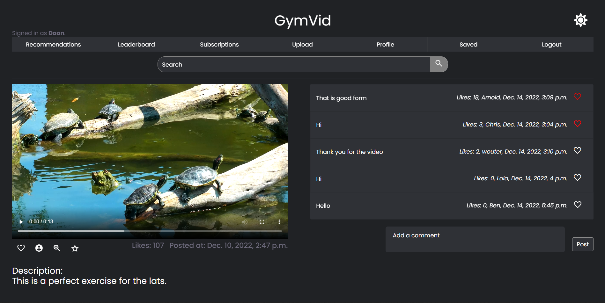
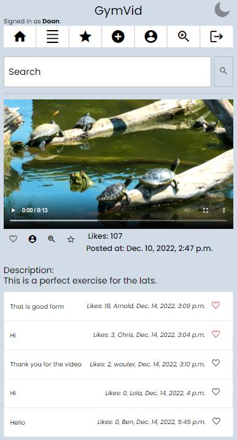

# Gymvid

> *Wouter Bant -- Django project for the course programmeerproject.*

## Description

- A video platform for sports videos.

- No distraction with other content.

- The possibility to subscribe to creators and get personal training schemes.

## Screencast

[](https://youtu.be/kXZJH9oS_1w "Django project programmeerproject")

- Template used in the video: [Uploaded scheme](docs/demo.xlsx)

## Screenshots



<p align="center">
    
</p>


## Getting Started

### Installation

This project requires Python version 3.7 or later. To install all dependencies run: 

```
pip3 install -r requirements.txt
```

### How to run

```
python3 manage.py runserver
```

## Tools used
- Python (Django)
- JavaScript
- HTML
- CSS
- Bootstrap

## Acknowledgments

- Code for generating the table for the personal training scheme from: https://levelup.gitconnected.com/how-to-write-a-pandas-dataframe-as-a-pdf-5cdf7d525488 (December 1st, 2022), this code can be found in the [util.py](videos/util.py) file in the videos folder.

- Code for login, logout, and registration from the template for project 2 (Commerce) of Harvard's OpenCourseWare CS50's Web Programming with Python and JavaScript: https://cs50.harvard.edu/web/2020/projects/2/commerce/, this code can be found in the [views.py](videos/views.py) file in the videos folder.

- Images used in the screencast: https://unsplash.com/s/photos/gym

- Video used in the screencast: https://mixkit.co/free-stock-video/small-turtles-basking-in-the-sun-12813/

## License

MIT